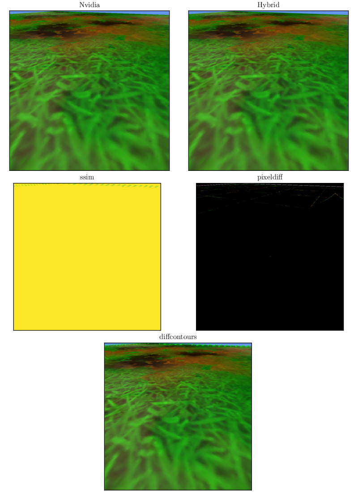

# How to use

Use flag `-h` for help.

## Examples

### Example 1
Generate **image** comparing **Nvidia/groundhorizon.png** to **Hybrid/groundhorizon.png**; using method **ssim**, **pixeldiff**, and **contours**; **show original images**; display names **Nvidia** and **Hybrid**; **output to test.png**.
> ```python compare.py image Nvidia/groundhorizon.png Hybrid/groundhorizon.png -m ssim pixeldiff diffcontours -s -n Nvidia Hybrid -o test.png```

Output:



### Example 2
Generate **table** comparing images in folder **'Nvidia'**; in column **'Intel'** compare Nvidia's to those in folder **'Intel'**; in column **'Hybrid'** compare Nvidia's to those in folder **'Hybrid'**; using all metrics, output to out.tex (default).
> ```python compare.py table Nvidia -g Intel Intel -g Hybrid Hybrid```

Output:

\begin{tabular}{lrrrrrrrr}
\toprule
Metric & \multicolumn{2}{r}{MSE} & \multicolumn{2}{r}{NRMSE} & \multicolumn{2}{r}{PSNR} & \multicolumn{2}{r}{SSIM} \\
Implementation & Hybrid & Intel & Hybrid & Intel & Hybrid & Intel & Hybrid & Intel \\
\midrule
groundzoomed & 0.000006 & 0.101684 & 0.000031 & 0.003970 & 100.172003 & 58.058261 & 1.000000 & 0.999538 \\
groundhorizon & 1.881802 & 2.040765 & 0.016886 & 0.017585 & 45.385065 & 45.032873 & 0.999309 & 0.998586 \\
groundabove & 0.005970 & 0.005970 & 0.001136 & 0.001136 & 70.371212 & 70.371212 & 0.999973 & 0.999973 \\
teapotside & 1.873410 & 1.886016 & 0.007772 & 0.007798 & 45.404476 & 45.375350 & 0.998354 & 0.998252 \\
teapotabove & 2.323055 & 2.289315 & 0.008522 & 0.008460 & 44.470208 & 44.533749 & 0.997160 & 0.997088 \\
teapotzoomed & 0.518601 & 1.189553 & 0.003578 & 0.005419 & 50.982474 & 47.376965 & 0.998879 & 0.995451 \\
\bottomrule
\end{tabular}

### Example 3
**Flag -p: generate plot.** Compare **'Intel'** with images in **'Intel'** to **'Hybrid'** with images in **'Hybrid'**, using metric **ssim**. Output to out.png (default). 
> ```python compare.py table Nvidia -g Intel Intel -g Hybrid Hybrid -m ssim -p```

Output:


